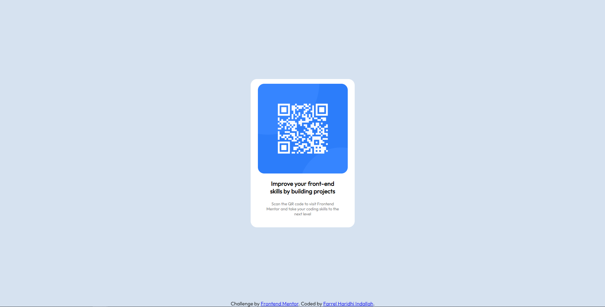

# Frontend Mentor - QR code component solution

This is my solution to the [QR code component challenge on Frontend Mentor](https://www.frontendmentor.io/challenges/qr-code-component-iux_sIO_H). Frontend Mentor challenges help you improve your coding skills by building realistic projects. 

## Table of contents

- [Overview](#overview)
  - [Screenshot](#screenshot)
  - [Links](#links)
- [My process](#my-process)
  - [Built with](#built-with)
  - [What I learned](#what-i-learned)
  - [Continued development](#continued-development)
  - [Useful resources](#useful-resources)
- [Author](#author)
- [Acknowledgments](#acknowledgments)

## Overview
This repository contains my personal solution for [QR code component challenge on Frontend Mentor](https://www.frontendmentor.io/challenges/qr-code-component-iux_sIO_H). 

If there's any input/advice/recommendation that you want to add. Please send your comment in the issues tab.

Thank you! 🙏

### Screenshot

### Links

- Solution URL: [GitHub Solution URL here](https://github.com/farrel-hi/frontend-mentor-qr-code-project)
- Live Site URL: [Live site URL here](https://stalwart-fudge-a6445d.netlify.app/)

## My process

### Built with

- Semantic HTML5 markup
- CSS custom properties
- Flexbox
- [Styled Components](https://styled-components.com/) - For styles

### What I learned

Here are the things that i learn:
1. Learn when to use min-height and height.
2. Learn how to use some relative units (ex: vh & %)
3. Learn how to use flexbox

### Continued development

I would like to continue develop my skill as a whole through projects from [Frontend Mentor](https://www.frontendmentor.io/).

### Useful resources

- [W3School](https://www.w3schools.com/)
- [HTML Documentation](https://developer.mozilla.org/en-US/docs/Web/HTML)

## Author

- Frontend Mentor - [@farrel-hi](https://www.frontendmentor.io/profile/farrel-hi)

## Acknowledgments
